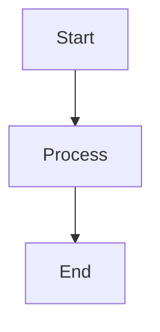

# Mermaid to PNG

A command-line tool that converts Mermaid diagrams in markdown files to PNG/JPEG images.

## Features

- Automatically finds and converts all Mermaid code blocks in markdown files
- Supports PNG and JPEG output formats
- Customizable image quality and scale
- Preserves original markdown structure
- Production-ready with comprehensive test coverage

## Installation

```bash
npm install -g mermaid-to-png
```

Or run directly with npx:

```bash
npx mermaid-to-png your-file.md
```

## Usage

```bash
mermaid-to-png [options] <markdown-file>
```

### Options

- `-o, --output <path>` - Directory to save generated images (default: `./images`)
- `-f, --format <format>` - Image format: `png` or `jpeg` (default: `png`)
- `-q, --quality <number>` - JPEG quality 1-100 (default: `85`, only applies to JPEG)
- `-s, --scale <number>` - Device scale factor for higher resolution 1-5 (default: `2`)
- `-v, --verbose` - Enable verbose logging
- `--validate-only` - Only validate Mermaid syntax without converting
- `--auto-fix` - Attempt to automatically fix common Mermaid syntax issues
- `-V, --version` - Output the version number
- `-h, --help` - Display help for command

### Examples

Convert a markdown file with default settings:
```bash
mermaid-to-png document.md
```

Convert to JPEG with custom quality:
```bash
mermaid-to-png document.md --format jpeg --quality 95
```

Save images to a specific directory:
```bash
mermaid-to-png document.md --output ./assets/diagrams
```

Generate high-resolution images:
```bash
mermaid-to-png document.md --scale 3
```

Validate Mermaid syntax without converting:
```bash
mermaid-to-png document.md --validate-only
```

Auto-fix common syntax issues and convert:
```bash
mermaid-to-png document.md --auto-fix
```

Verbose mode with auto-fix:
```bash
mermaid-to-png document.md --auto-fix --verbose
```

## How It Works

1. The tool reads your markdown file and finds all Mermaid code blocks
2. Each Mermaid diagram is rendered to an image using Puppeteer
3. The original Mermaid code blocks are replaced with image references
4. A new markdown file is created with `-converted` suffix
5. All images are saved to the specified output directory

### Example

Input markdown:
````markdown
# My Document

Here's a flowchart:


````

Output markdown:
```markdown
# My Document

Here's a flowchart:


```

## Auto-Fix Feature

The tool can automatically fix common Mermaid syntax issues that cause parsing errors:

### Supported Fixes

- **Parentheses in node labels**: `(N-1)` → `N-1`
- **Mathematical expressions**: `(X+Y)` → `X+Y`
- **Range notation**: `1B-2B-3B` → `1B to 2B to 3B` (in video/data contexts)
- **Malformed arrows**: `MS --> >API` → `MS --> API`
- **Arrow spacing**: `A-->B` → `A --> B`
- **Subgraph formatting**: Ensures proper quote formatting

### Usage

```bash
# Validate only (shows issues without fixing)
mermaid-to-png document.md --validate-only

# Auto-fix and convert
mermaid-to-png document.md --auto-fix

# See what's being fixed
mermaid-to-png document.md --auto-fix --verbose
```

**⚠️ Important**: Auto-fix modifies your original markdown file. Consider backing up your files or using version control before running with `--auto-fix`.

## Development

### Setup

```bash
git clone <repository>
cd mermaid-to-png
npm install
```

### Scripts

- `npm run build` - Build the TypeScript project
- `npm run dev` - Run in development mode
- `npm test` - Run unit tests
- `npm run test:integration` - Run integration tests
- `npm run test:coverage` - Run tests with coverage report
- `npm run lint` - Type check the code

### Project Structure

```
mermaid-to-png/
├── src/
│   ├── __tests__/          # Integration tests
│   │   ├── fixtures/       # Test markdown files
│   │   └── integration.test.ts
│   ├── cli.ts              # CLI entry point
│   ├── converter.ts        # Main conversion logic
│   ├── converter.test.ts   # Unit tests for converter
│   ├── mermaid-renderer.ts # Puppeteer-based rendering
│   ├── mermaid-renderer.test.ts # Unit tests for renderer
│   ├── types.ts           # TypeScript type definitions
│   └── utils/
│       ├── validator.ts    # Input validation
│       ├── validator.test.ts # Unit tests for validator
│       ├── mermaid-fixer.ts # Auto-fix utilities
│       └── mermaid-fixer.test.ts # Unit tests for fixer
├── dist/                   # Compiled JavaScript
├── jest.config.js         # Jest configuration
├── jest.integration.config.js # Integration test config
├── LICENSE                # MIT license
└── tsconfig.json          # TypeScript configuration
```

## Requirements

- Node.js 14 or higher
- npm or yarn

## License

MIT