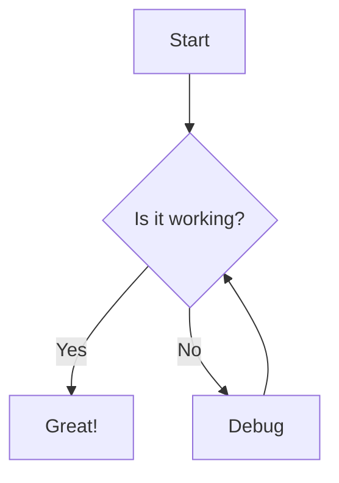
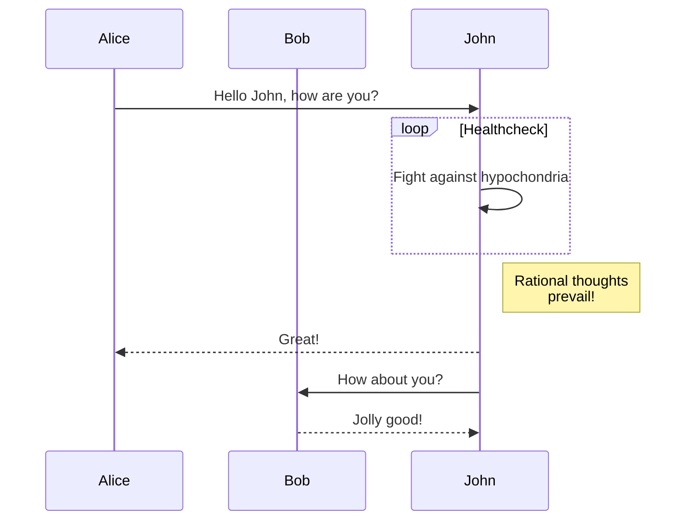
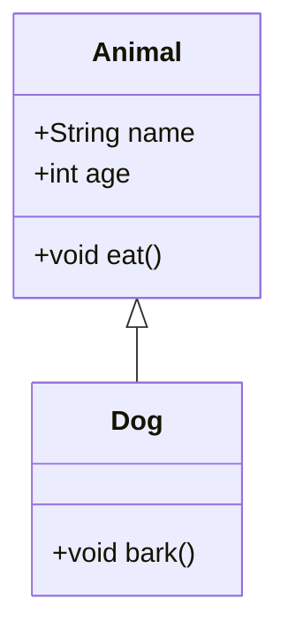

# Sample Markdown with Mermaid Diagrams

This is a test document with multiple Mermaid diagrams.

## Flowchart Example

Here's a simple flowchart:



## Sequence Diagram

And here's a sequence diagram:



## Regular Code Block

This should not be converted:

```javascript
console.log('Hello, World!');
```

## Class Diagram



That's all for now!